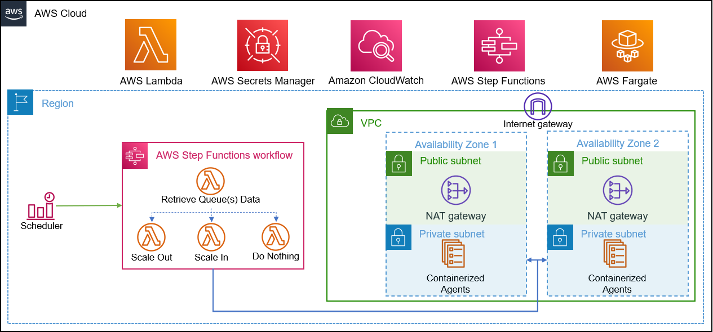
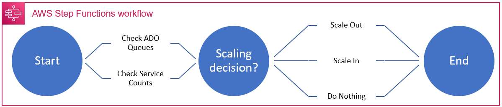
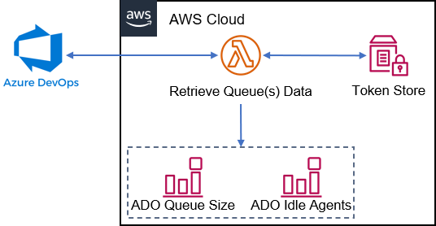
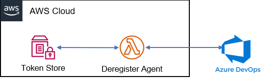

# AWS Autoscaling Container Build Agent Solution for Azure DevOps Services

A solution to autoscale containerised build agents, dependent on Azure DevOps Queue Sizes.  This model provides the flexibility for development teams to manage their own build dependencies and build queues, while removing the infrastructure maintenance overhead and keeping cost at a minimum.  It utilises the RunTask method of execution, rather than scaling an existing ECS service, for 2 reasons:
- There was no way to guarantee graceful agent termination (i.e. without risk of terminating a running build job) through service autoscaling
- Currently, ECS autoscaling does not support custom metrics

## Current State
- All required resources deployed from within terraform
- Cloudwatch will trigger the state machine, which will decide whether to launch or terminate containerised agents, based on the Azure DevOps Agent Queue size
- This can be used to supplement existing pools, or in new pools.  
    - If used in a new pool, at least one agent must have existed - to force jobs to queue - rather than failing as there are no agents.  This can be achieved by registering an agent on a local machine and then terminating.
- If there are no queueing jobs, only the state machine and queue check lambdas will execute, populating Cloudwatch metrics and keeping costs low.

## Architecture

## State Machine

## Queue Data Function

## Deregister Agent Function

## Cost Estimate - Retail Price, checked on 14/1/2022*
### Assumptions
- Workflow executes every 2 minutes
- 100 Agent Jobs per Day
    - 5 mins per job
- Linux agent
    - 0.25 CPU
    - 512MB Memory
- Existing VPC and networking resources
- Single agent image, stored in ECR
- Free Tier included
- Hosted in us-east-1

| Service | Upfront Costs | Monthly Costs | First 12 Months | Currency | Summary |
| --- | --- | --- | --- | --- | --- |
| Step Functions - Express Workflows | 0 | 0.09 | 1.08 | USD | Duration of each workflow (3000), Memory consumed by each workflow (64 MB), Workflow requests (21600 per month) |
| AWS Lambda | 0 | 0 | 0 | USD | Architecture (x86), Architecture (x86), Number of requests (129600 per month) |
| AWS Fargate | 0 | 3.38 | 40.56 | USD | Operating system (Linux), CPU Architecture (x86), Average duration (5 minutes), Number of tasks or pods (100 per day), Amount of ephemeral storage allocated for Amazon ECS (20 GB) |
| AWS Elastic Container Registry | 0 | 1 | 12 | USD | Data transfer cost (0), Amount of data stored (10 GB per month) |
| AWS Secrets Manager | 0 | 0 | 0.51 | USD | Number of secrets (1), Average duration of each secret (30 days), Number of API calls (21600 per month) |
| AWS Parameter Store | 0 | 0 | 0 | USD | Standard parameters (1), Frequency of API interactions per parameter (30 per hour) |
| AWS Cloudwatch | 0 | 1.032 | 12.38 | USD | Number of Metrics (includes detailed and custom metrics) (2), Number of other API requests (43200) |
|  |  |  |  |  |  |
| Total | 0 | 6.01 | 72.14 | USD |  |

*These are only an estimate of potential AWS fees and doesn't include any taxes that might apply. Your actual fees depend on a variety of factors, including your actual usage of AWS services. [Do your own calculations](https://calculator.aws/#/estimate) and be prepared to accept the financial ask, before using.

## Notes:
- Workflow is triggered on a schedule.  Originally, triggered by CW event, but this method is more reliable and cost effective
- Supports multiple agent queues, by calling multiple instances of the module
- Max service count influenced by licenses held for self-hosted agents in Azure DevOps
- Agents will be terminated if they are idel and there are no jobs queuing

## Future
- Abstract hard-coded container config to default variables
- Waiter to validate task running/task stopped
- RunTask supports max 10 instances/call.  Need validation
- Configurable Template for task definitions
- Exceptions for Queue API call result in SNS alert
- Architecture for shared-services implementation - Using VPC Interface Endpoints and NAT gateways in a shared VPC

## Requirements

| Name | Version |
|------|---------|
| aws cli | [aws](https://docs.aws.amazon.com/cli/latest/userguide/getting-started-install.html) |
| pip3 | [>= 21.2.3](https://pip.pypa.io/en/stable/) |
| Terraform | [1.0.9](https://releases.hashicorp.com/terraform/1.0.9/) |
| provider/archive | [2.2.0](https://registry.terraform.io/providers/hashicorp/archive) |
| provider/aws | [3.6.3](https://registry.terraform.io/providers/hashicorp/aws) |

## Inputs

| Name | Description | Type | Default | Required |
|------|-------------|------|---------|:--------:|
| agent_cw_metric_prefix | Prefix for Cloudwatch Metric | string | Queue | N |
| assign_public_ip | Assign Public IP to Container | string | DISABLED | N |
| image_name | Name assigned to previously built docker image | string | adoagent | N |
| agent_cluster_name | Name to assign to the ECS Cluster | string | n/a | Y |
| agent_cw_namespace | Name to assign as the Cloudwatch Namespace for Azure DevOps Queue Metrics | string | n/a | Y |
| ado_org_name | Azure DevOps Service Org Name | string | n/a | Y |
| ado_pool_id | ID of Azure DevOps Agent Pool | int | n/a | Y |
| ado_pool_name | Name of Azure DevOps Agent Pool | string | n/a | Y |
| ado_pat | Personal Access Token scoped for Pool Management | string | n/a | Y |
| agent_security_group | AWS Security group ID for group with outbound access enabled (used by agent containers to communicate with Azure DevOps) | string | n/a | Y |
| subnet | AWS Private Subnet ID for containers to launch into | string | n/a | Y |

## Outputs
None

## Example Usage
* [Single Agent Queue, Existing VPC](https://github.com/paulci/cloud-solutions/tree/master/aws/autoscaling-cicd-agents/terraform/examples/single_queue_existing_vpc)
* [Single Agent Queue, With New VPC](https://github.com/paulci/cloud-solutions/tree/master/aws/autoscaling-cicd-agents/terraform/examples/single_queue_new_vpc)
* [Single Agent Queue, in Public Subnet](https://github.com/paulci/cloud-solutions/tree/master/aws/autoscaling-cicd-agents/terraform/examples/single_queue_public_subnet)

## Resources

| Name | Type | Instances |
|------|------|------|
| module.<instance>.aws_iam_policy.ado_queue_metrics | [aws_iam_policy](https://registry.terraform.io/providers/hashicorp/aws/latest/docs/resources/iam_policy) | x instance of module |
| module.<instance>.aws_iam_role_policy_attachment.ado_deregister_agents_function | [aws_iam_role_policy_attachment](https://registry.terraform.io/providers/hashicorp/aws/latest/docs/resources/iam_role_policy_attachment) | x instance of module |
| module.<instance>.aws_iam_role_policy_attachment.ado_queue_metrics | [aws_iam_role_policy_attachment](https://registry.terraform.io/providers/hashicorp/aws/latest/docs/resources/iam_role_policy_attachment) | x instance of module |
| module.<instance>.aws_iam_role_policy_attachment.scaling_decider_function | [aws_iam_role_policy_attachment](https://registry.terraform.io/providers/hashicorp/aws/latest/docs/resources/iam_role_policy_attachment) | x instance of module |
| module.<instance>.aws_secretsmanager_secret.adopat | [aws_secretsmanager_secret](https://registry.terraform.io/providers/hashicorp/aws/latest/docs/resources/secretsmanager_secret) | x instance of module |
| module.<instance>.aws_secretsmanager_secret_version.base64pat | [aws_secretsmanager_secret_version](https://registry.terraform.io/providers/hashicorp/aws/latest/docs/resources/secretsmanager_secret_version) | x instance of module |
| module.<instance>.module.ado_deregister_agents_function.aws_iam_role.lambda_execution | [aws_iam_role](https://registry.terraform.io/providers/hashicorp/aws/latest/docs/resources/iam_role) | x instance of module |
| module.<instance>.module.ado_deregister_agents_function.aws_lambda_function.function | [aws_lambda_function](https://registry.terraform.io/providers/hashicorp/aws/latest/docs/resources/lambda_function) | x instance of module |
| module.<instance>.module.ado_queue_function.aws_iam_role.lambda_execution | [aws_iam_role](https://registry.terraform.io/providers/hashicorp/aws/latest/docs/resources/iam_role) | x instance of module |
| module.<instance>.module.ado_queue_function.aws_lambda_function.function | [aws_lambda_function](https://registry.terraform.io/providers/hashicorp/aws/latest/docs/resources/lambda_function) | x instance of module |
| module.<instance>.module.common_dependencies.aws_lambda_layer_version.lambda_dependencies | [aws_lambda_layer_version](https://registry.terraform.io/providers/hashicorp/aws/latest/docs/resources/lambda_layer_version) | x instance of module |
| module.<instance>.module.common_dependencies.null_resource.install_python_dependencies | [null_resource](https://registry.terraform.io/providers/hashicorp/null/latest/docs/resources/resource) | x instance of module |
| module.<instance>.module.scaling_decider_function.aws_iam_role.lambda_execution | [aws_iam_role](https://registry.terraform.io/providers/hashicorp/aws/latest/docs/resources/iam_role) | x instance of module |
| module.<instance>.module.scaling_decider_function.aws_lambda_function.function | [aws_lambda_function](https://registry.terraform.io/providers/hashicorp/aws/latest/docs/resources/lambda_function) | x instance of module |
| module.<instance>.module.scaling_workflow.aws_cloudwatch_event_rule.ado_scaling_workflow | [aws_cloudwatch_event_rule](https://registry.terraform.io/providers/hashicorp/aws/latest/docs/resources/cloudwatch_event_rule) | x instance of module |
| module.<instance>.module.scaling_workflow.aws_cloudwatch_event_target.sfn |  [aws_cloudwatch_event_target](https://registry.terraform.io/providers/hashicorp/aws/latest/docs/resources/cloudwatch_event_target) | x instance of module |
| module.<instance>.module.scaling_workflow.aws_cloudwatch_log_group.ado_agent_logs | [aws_cloudwatch_log_group](https://registry.terraform.io/providers/hashicorp/aws/latest/docs/resources/cloudwatch_log_group) | x instance of module |
| module.<instance>.module.scaling_workflow.aws_cloudwatch_log_group.scaling_workflow |  [aws_cloudwatch_log_group](https://registry.terraform.io/providers/hashicorp/aws/latest/docs/resources/cloudwatch_log_group) | x instance of module |
| module.<instance>.module.scaling_workflow.aws_ecr_repository.adoagent | [aws_ecr_repository](https://registry.terraform.io/providers/hashicorp/aws/latest/docs/resources/ecr_repository)| x instance of module |
| module.<instance>.module.scaling_workflow.aws_ecs_cluster.ado_agent_pool | [aws_ecs_cluster](https://registry.terraform.io/providers/hashicorp/aws/latest/docs/resources/ecs_cluster) | x instance of module |
| module.<instance>.module.scaling_workflow.aws_ecs_task_definition.ado_agent_task |  [aws_ecs_task_definition](https://registry.terraform.io/providers/hashicorp/aws/latest/docs/resources/ecs_task_definition) | x instance of module |
| module.<instance>.module.scaling_workflow.aws_iam_role.agent_task_role | [aws_iam_role](https://registry.terraform.io/providers/hashicorp/aws/latest/docs/resources/iam_role) | x instance of module |
| module.<instance>.module.scaling_workflow.aws_iam_role.cloudwatch_sfn_execution | [aws_iam_role](https://registry.terraform.io/providers/hashicorp/aws/latest/docs/resources/iam_role) | x instance of module |
| module.<instance>.module.scaling_workflow.aws_iam_role.sfn_execution | [aws_iam_role](https://registry.terraform.io/providers/hashicorp/aws/latest/docs/resources/iam_role) | x instance of module |
| module.<instance>.module.scaling_workflow.aws_iam_role_policy.agent_task_execution_policy | [aws_iam_role_policy](https://registry.terraform.io/providers/hashicorp/aws/latest/docs/resources/iam_role_policy) | x instance of module |
| module.<instance>.module.scaling_workflow.aws_iam_role_policy.cloudwatch_sfn_execution | [aws_iam_role_policy](https://registry.terraform.io/providers/hashicorp/aws/latest/docs/resources/iam_role_policy) | x instance of module |
| module.<instance>.module.scaling_workflow.aws_iam_role_policy.workflow_execution_policy | [aws_iam_role_policy](https://registry.terraform.io/providers/hashicorp/aws/latest/docs/resources/iam_role_policy) | x instance of module |
| module.<instance>.module.scaling_workflow.aws_kms_key.agent_data | [aws_kms_key](https://registry.terraform.io/providers/hashicorp/aws/latest/docs/resources/kms_key) | x instance of module |
| module.<instance>.module.scaling_workflow.aws_sfn_state_machine.scaling_queue | [aws_sfn_state_machine](https://registry.terraform.io/providers/hashicorp/aws/latest/docs/resources/sfn_state_machine) | x instance of module |
| module.<instance>.module.scaling_workflow.aws_ssm_parameter.ado_pat | [aws_ssm_parameter](https://registry.terraform.io/providers/hashicorp/aws/latest/docs/resources/ssm_parameter) | x instance of module |