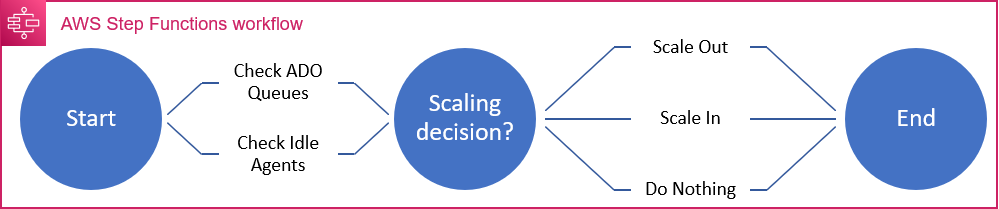

# WIP - AWS Autoscaling Container Build Agent Solution for Azure DevOps Services

A solution to autoscale containerised build agents, dependent on Azure DevOps Queue Sizes.  This model provides the flexibility for development teams to manage their own build dependencies and build queues, while removing the infrastructure maintenance overhead and keeping cost at a minimum.

## Current State
- Deployable Lambda function, with IAM Roles, Policy & Secret to poll Azure DevOps queue and populate Cloudwatch
    - Unit tested code, input structure validation
    - Confirmed deploylable and successfully operates in us-east-1
- Queues can be configured as [individual json files](src/ado_queue_function/config/example.json)
- No automated trigger
- No state machine
- No Alarms
- No agents/container infrastructure
- No agent capacity monitoring

## Architecture


## State Machine



## Notes:
- Workflow is triggered if queue count is consistently above baseline or service count is consistently above baseline
- Supports multiple agent queues, configurable by <>
- Max service count influenced by licenses held for self-hosted agents in Azure DevOps <insert links to dock>
- Agents are immutable and will terminate after each execution
- On scale-in, attempts are made to ensure no running jobs are terminated

## Future
- Queue Config managed in DynamoDB rather than flat file
- Exceptions for Queue API call result in SNS alert

## Requirements

| Name | Version |
|------|---------|
| Terraform | [1.0.9]() |
| provider/archive | [2.2.0](https://registry.terraform.io/providers/hashicorp/archive) |
| provider/aws | [3.6.3](https://registry.terraform.io/providers/hashicorp/aws) |

## Inputs

| Name | Description | Type | Default | Required |
|------|-------------|------|---------|:--------:|
| ado_org_name | Azure DevOps Service Org Name | string | n/a | Y |
| function_timeout_seconds | Lambda Timeout Configuration | number | 60 | N |


## Outputs

| Name | Description |
|------|-------------|


## Example Usage
### Deploy Resources to AWS
```
terraform apply -var 

...
Apply complete! Resources: <>

Outputs:

<>
```


## Current (WIP) Resources

| Name | Type |
|------|------|
| aws_iam_policy.ado_queue_metrics | [aws_iam_policy](https://registry.terraform.io/providers/hashicorp/aws/latest/docs/resources/iam_policy) |
| aws_iam_role_policy_attachment.ado_queue_metrics | [aws_iam_role_policy_attachment](https://registry.terraform.io/providers/hashicorp/aws/latest/docs/resources/iam_role_policy_attachment) |
| aws_secretsmanager_secret.adopat | [aws_secretsmanager_secret](https://registry.terraform.io/providers/hashicorp/aws/latest/docs/resources/secretsmanager_secret) |
| module.ado_queue_function.aws_iam_role.lambda_execution | [aws_iam_role](https://registry.terraform.io/providers/hashicorp/aws/latest/docs/resources/iam_role) |
| module.ado_queue_function.aws_lambda_function.function | [aws_lambda_function](https://registry.terraform.io/providers/hashicorp/aws/latest/docs/resources/lambda_function) |