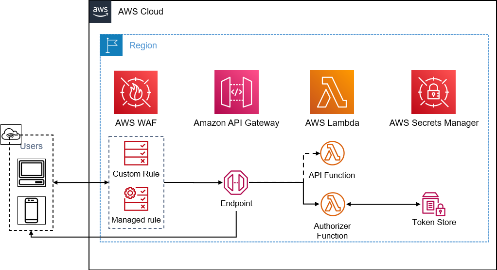

# AWS API Gateway Terraform Solution

PoC for a low cost, scalable, publicly available REST API with improved security and auditability.

## Architecture



## Notes:
- Simple Python authorizer returns a deny/allow policy depending on successfully decoded token
- Calls to API must pass a [JWT](https://jwt.io/) - encoded with the chosen secret - in the 'x-api-key' header
- Applied [WAF](https://aws.amazon.com/waf/) Rules cover [AWS Core Rules](https://docs.aws.amazon.com/waf/latest/developerguide/aws-managed-rule-groups-list.html) and [Known Bad Inputs](https://docs.aws.amazon.com/waf/latest/developerguide/aws-managed-rule-groups-list.html)
- Logging and monitoring enabled in [Cloudwatch](https://aws.amazon.com/cloudwatch/) for [Lambda](https://aws.amazon.com/lambda/aws ) and WAF
- [AWS Secrets Manager](https://aws.amazon.com/secrets-manager/) used for JWT secret key
- Lambda packages automatically repackaged and deployed on handler code or dependency change
- Tagging not present as there's no single strategy, but tags should be implemented in any deployed solution

## Requirements

| Name | Version |
|------|---------|
| Terraform | [1.0.9]() |
| provider/archive | [2.2.0](https://registry.terraform.io/providers/hashicorp/archive) |
| provider/aws | [3.6.3](https://registry.terraform.io/providers/hashicorp/aws) |

## Inputs

| Name | Description | Type | Default | Required |
|------|-------------|------|---------|:--------:|
| api_name | Name for the API | string | n/a | Y |
| resource_path | API Path | string | n/a | Y |
| jwt_secret | Secret for JWT encoding/decoding | string | n/a | Y |


## Outputs

| Name | Description |
|------|-------------|
| v1_invoke_url | Callable endpoint for deployed API |

## Example Usage
### Deploy Resources to AWS
```
terraform apply -var api_name=mynewapi -var resource_path=hello -var jwt_secret=<myjwtsecret>

...
Apply complete! Resources: 22 added, 0 changed, 0 destroyed.

Outputs:

v1_invoke_url = "https://xxxxxxxxxx.execute-api.us-east-1.amazonaws.com/v1/hello"
```

### API Call - Windows/Powershell
Valid Token
```
PS C:\Users\paul> Invoke-WebRequest https://xxxxxxxxxx.execute-api.us-east-1.amazonaws.com/v1/hello -Headers @{'Accept' = 'application/json'; 'x-api-key' = 'my.jwt.token'}


StatusCode        : 200
StatusDescription : OK
Content           : "Hello from Lambda, 85.10.106.22!"
RawContent        : HTTP/1.1 200 OK
                    Connection: keep-alive
                    x-amzn-RequestId: f434359d-0033-a856-4e20-e26f6ac13f7e
                    x-amz-apigw-id: Gu0E4UIHgAMFSMQ=
                    X-Amzn-Trace-Id: Root=1-feb6162b-68f7011b629b36f22d2159bd;Sampled=0
                    ...
Forms             : {}
Headers           : {[Connection, keep-alive], [x-amzn-RequestId, f434359d-0033-a856-4e20-e26f6ac13f7e],
                    [x-amz-apigw-id, Gu0E4UIHgAMFSMQ=], [X-Amzn-Trace-Id,
                    Root=1-feb6162b-68f7011b629b36f22d2159bd;Sampled=0]...}
Images            : {}
InputFields       : {}
Links             : {}
ParsedHtml        : mshtml.HTMLDocumentClass
RawContentLength  : 35
```
Invalid Token
```
PS C:\Users\paul> Invoke-WebRequest https://xxxxxxxxxx.execute-api.us-east-1.amazonaws.com/v1/hello -Headers @{'Accept' = 'application/json'; 'x-api-key' = 'invalidtoken'}

Invoke-WebRequest : {"Message":"User is not authorized to access this resource with an explicit deny"}
...
```

### API Call - Mac/Linux
Valid Token
```
$ curl --header "x-api-key: my.jwt.token" https://xxxxxxxxxx.execute-api.us-east-1.amazonaws.com/v1/hello

"Hello from Lambda, 85.10.106.22!"
```
Invalid Token
```
$ curl --header "x-api-key: invalidtoken" https://xxxxxxxxxx.execute-api.us-east-1.amazonaws.com/v1/hello

{"Message":"User is not authorized to access this resource with an explicit deny"}
```

## Resources

| Name | Type |
|------|------|
| module.pythonauthorizer.aws_iam_role.invocation_role | [aws_iam_role](https://registry.terraform.io/providers/hashicorp/aws/latest/docs/resources/iam_role) |
| module.webfunction.aws_iam_role.lambda_execution | [aws_iam_role](https://registry.terraform.io/providers/hashicorp/aws/latest/docs/resources/iam_role) |
| module.authfunction.aws_iam_role.lambda_execution | [aws_iam_role](https://registry.terraform.io/providers/hashicorp/aws/latest/docs/resources/iam_role) |
| aws_iam_policy.secrets_policy | [aws_iam_policy](https://registry.terraform.io/providers/hashicorp/aws/latest/docs/resources/iam_policy) |
| module.pythonauthorizer.aws_iam_role_policy.invocation_policy | [aws_iam_role_policy](https://registry.terraform.io/providers/hashicorp/aws/latest/docs/resources/iam_role_policy) |
| aws_iam_role_policy_attachment.secrets-lambda-attach | [aws_iam_role_policy_attachment](https://registry.terraform.io/providers/hashicorp/aws/latest/docs/resources/iam_role_policy_attachment) |
| module.webfunction.aws_iam_role_policy_attachment.cloudwatch-lambda-attach | [aws_iam_role_policy_attachment](https://registry.terraform.io/providers/hashicorp/aws/latest/docs/resources/iam_role_policy_attachment) |
| module.authfunction.aws_iam_role_policy_attachment.cloudwatch-lambda-attach | [aws_iam_role_policy_attachment](https://registry.terraform.io/providers/hashicorp/aws/latest/docs/resources/iam_role_policy_attachment) |
| aws_secretsmanager_secret.jwtkey | [aws_secretsmanager_secret](https://registry.terraform.io/providers/hashicorp/aws/latest/docs/resources/secretsmanager_secret) |
| aws_secretsmanager_secret_version.jwtkey | [aws_secretsmanager_secret_version](https://registry.terraform.io/providers/hashicorp/aws/latest/docs/resources/secretsmanager_secret_version) |
| module.webfunction.aws_lambda_function.function | [aws_lambda_function](https://registry.terraform.io/providers/hashicorp/aws/latest/docs/resources/lambda_function) |
| module.authfunction.aws_lambda_function.function |  [aws_lambda_function](https://registry.terraform.io/providers/hashicorp/aws/latest/docs/resources/lambda_function) |
| module.helloresource.aws_lambda_permission.apigw_lambda | [aws_lambda_permission](https://registry.terraform.io/providers/hashicorp/aws/latest/docs/resources/lambda_permission) |
| aws_api_gateway_rest_api.modularapi | [aws_api_gateway_rest_api](https://registry.terraform.io/providers/hashicorp/aws/latest/docs/resources/api_gateway_rest_api) |
| module.pythonauthorizer.aws_api_gateway_authorizer.lambdaauth | [aws_api_gateway_authorizer](https://registry.terraform.io/providers/hashicorp/aws/latest/docs/resources/api_gateway_authorizer) |
| module.helloresource.aws_api_gateway_resource.modularresource | [aws_api_gateway_resource](https://registry.terraform.io/providers/hashicorp/aws/latest/docs/resources/api_gateway_resource) |
| module.helloresource.aws_api_gateway_method.modularresourcemethod | [aws_api_gateway_method](https://registry.terraform.io/providers/hashicorp/aws/latest/docs/resources/api_gateway_method_settings) |
| module.helloresource.aws_api_gateway_integration.lambdaintegration | [aws_api_gateway_integration](https://registry.terraform.io/providers/hashicorp/aws/latest/docs/resources/api_gateway_integration) |
| aws_api_gateway_deployment.v1 | [aws_api_gateway_deployment](https://registry.terraform.io/providers/hashicorp/aws/latest/docs/resources/api_gateway_deployment) |
| aws_api_gateway_stage.v1 | [aws_api_gateway_stage](https://registry.terraform.io/providers/hashicorp/aws/latest/docs/resources/api_gateway_stage) |
| aws_wafv2_web_acl.managedrules-acl | [aws_wafv2_web_acl](https://registry.terraform.io/providers/hashicorp/aws/latest/docs/resources/wafv2_web_acl) |
| aws_wafv2_web_acl_association.v1 | [aws_wafv2_web_acl_association](https://registry.terraform.io/providers/hashicorp/aws/latest/docs/resources/wafv2_web_acl_association) |
